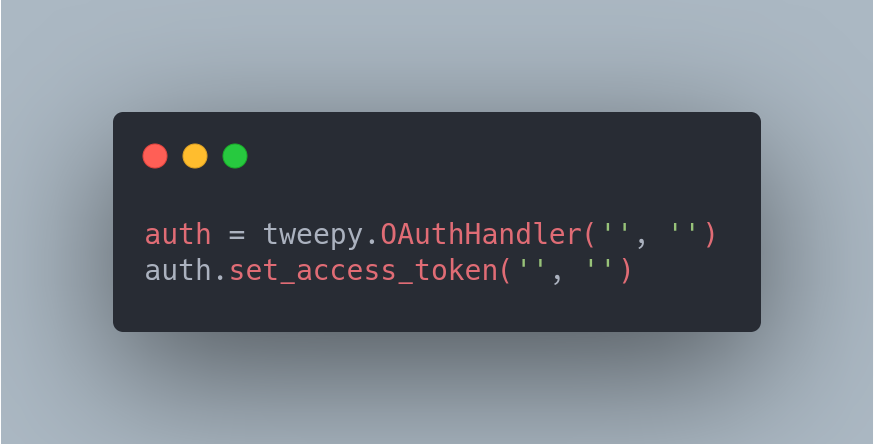
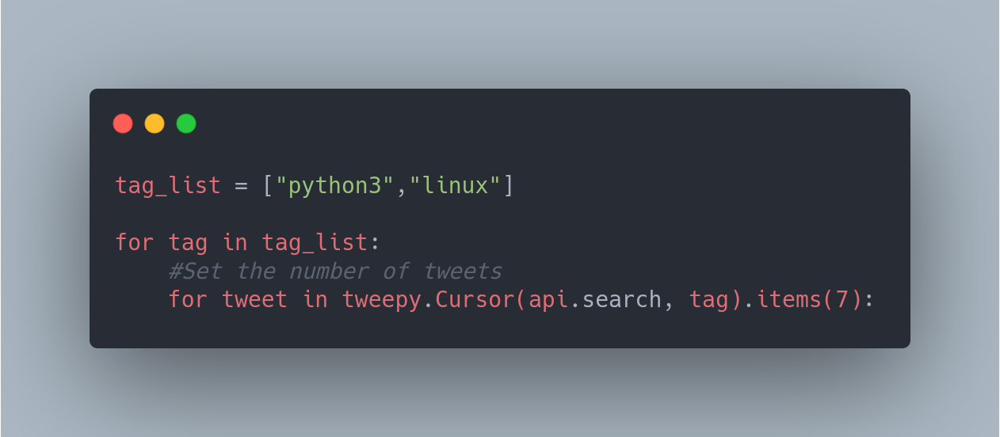
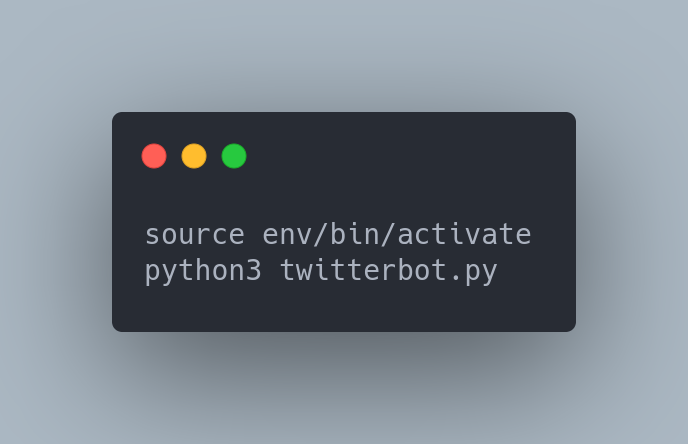

# TwitterBot
Sample twitter bot that shows the user's followers, public tweets in the timeline and like tweets by hashtag.

* ### Obtain your API tokens [here](https://developer.twitter.com/en/docs).
* ### Set your tokens:        
* ### To like tweets, set your desired *hashtag(s)* and the number of tweets you would like to like:
   
* ### Activate the virtualenv and run the script.
   
* ### Check out the [tweepy documentation](https://www.tweepy.org/) for more examples.

